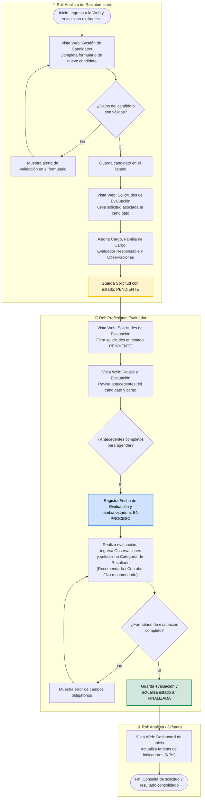

# AQUA-CONTRATOS
Repositorio dedicado una página web creada con React y node

# INDICE
- [Problematica](#problematica)
- [Solucion](#solución)
- [Requisitos funcionales](#requisitos-funcionales)

# PROBLEMATICA
AquaChile es una empresa del rubro acuícola que desarrolla operaciones productivas y administrativas en distintas áreas de gestión. Dentro de sus procesos internos, el área de Reclutamiento y Selección requiere coordinar evaluaciones psicolaborales para candidatos que postulan a distintos cargos.
Actualmente se lleva a cabo todo el proceso en fisico (papeles) y varias herramientas digitales, debido a esto el flujo es torpe y muy propenso a errores, tanto de parte del equipo de contratacion, los departamentos internos y los postulantes

# SOLUCIÓN
Aqua-Contratos es una página web que centraliza información básica del proceso de evaluación psicolaboral, permitiendo registrar candidatos, crear solicitudes, hacer seguimiento de estados y consultar antecedentes relevantes desde una aplicación Full Stack.

# REQUISITOS FUNCIONALES
|Código|Requerimiento funcional|Prioridad|
|:---|---|:---:|
|RF01|Permitir ingreso simple al sistema con usuarios ficticios o roles simulados|
Alta
|
|RF02|Registrar candidatos con datos mínimos obligatorios|
Alta
|
|RF03|Editar y consultar información principal de un candidato|
Alta
|
|RF04|Crear solicitudes de evaluación asociadas a un candidato|
Alta
|
|RF05|Registrar cargo, familia de cargo, fecha de solicitud y responsable|
Alta
|
|RF06|Visualizar listado de solicitudes y consultar su detalle|
Alta
|
|RF07|Buscar o filtrar solicitudes por estado, fecha, cargo o candidato|
Media
|
|RF08|Actualizar el estado de la solicitud: Pendiente, En proceso o Finalizada|
Alta
|
|RF09|Registrar fecha de evaluación, observaciones o resultado general|
Alta
|
|RF10|Mostrar dashboard simple con indicadores generales del proceso|
Media
|

