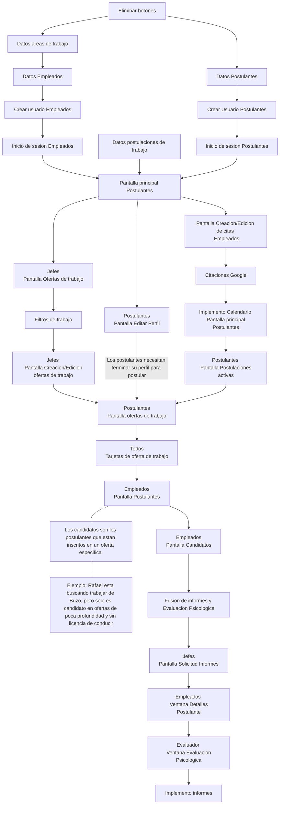

```mermaid
graph TD
    A[Eliminar botones]-->A2
    A2[Datos Postulantes]-->B1[Crear Usuario Postulantes]
    B1-->B2
    A-->C1[Datos areas de trabajo]
    C1-->C2[Datos Empleados]
    C2-->C3[Crear usuario Empleados]
    C3-->C4
    C4[Inicio de sesion Empleados]-->B3
    D1[Datos postulaciones de trabajo]-->B3
    B2[Inicio de sesion Postulantes]-->B3
    B3[Pantalla principal Postulantes]-->F1[Jefes <br/> Pantalla Ofertas de trabajo]
    F1-->F4[Filtros de trabajo]
    F4-->F2[Jefes <br/> Pantalla Creacion/Edicion ofertas de trabajo]
    F2-->F3[Postulantes <br/>Pantalla ofertas de trabajo]
    B3-->B4[Postulantes <br/> Pantalla Editar Perfil]
    B4 --->|Los postulantes necesitan terminar su perfil para postular|F3
    B3-->E1[Pantalla Creacion/Edicion de citas <br/> Empleados]
    E1-->E2[Citaciones Google]
    E2-->E3[Implemento Calendario <br/> Pantalla principal Postulantes]
    E3-->E4[Postulantes <br/> Pantalla Postulaciones activas]-->F3
    F3-->F6[Todos <br/> Tarjetas de oferta de trabajo]-->D2
    D2[Empleados <br/> Pantalla Postulantes]
    D2-.-D2A[Los candidatos son los postulantes que estan inscritos en un oferta especifica <br/>]
    D2A-.-D2B[Ejemplo: Rafael esta buscando trabajar de Buzo, pero solo es candidato en ofertas de poca profundidad y sin licencia de conducir]
    D2-->D3[Empleados <br/> Pantalla Candidatos]
    D3-->G1[Fusion de informes y Evaluacion Psicologica]
    G1-->G2[Jefes <br/> Pantalla Solicitud Informes]
    G2-->G3[Empleados <br/> Ventana Detalles Postulante]
    G3-->G4[Evaluador <br/> Ventana Evaluacion Psicologica]
    G4-->G5[Implemento informes] 
```
